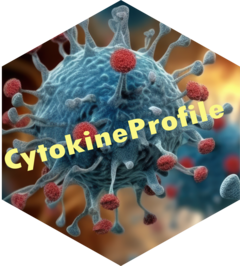

<!-- README.md is generated from README.Rmd. Please edit that file -->

<!-- badges: start -->

**Stable Build Status:**

**Development Version:**

<!-- badges: end -->

# CytokineProfile Shiny Application 

The goal of CytokineProfile Shiny is to conduct quality control using
biological meaningful cutoff on raw measured values of cytokines.
Specifically, test on distributional symmetry to suggest the adopt of
transformation. Conduct exploratory analysis including summary
statistics, generate enriched barplots, and boxplots. Further, conduct
univariate analysis and multivariate analysis for advance analysis. It
provides an overall user-friendly experience for users to conduct
analyses on their own data. For advanced users, the CytoProfile R
package is available on
[Github](https://github.com/saraswatsh/CytoProfile) and at
[CRAN](https://cran.r-project.org/package=CytoProfile).

The Shiny application is available at [CytokineProfile Shiny
App](https://shiny.cytokineprofile.org).

## Features

- Data Upload & Built-in Data Options: Upload your own data files (CSV,
  TXT, Excel) or choose from built-in datasets.

- Dynamic Column Selection & Filtering: Easily select columns and apply
  filters based on categorical variables to focus your analysis.

- Multiple Analysis Functions:

  - Choose from several analysis functions, including but not limited
    to:
    1.  Univariate Analysis (e.g., T-test/Wilcoxon/ANOVA/Kruskal-Wallis)
    2.  Boxplots
    3.  Error-Bar Plots
    4.  Dual-Flashlight Plot
    5.  Heatmap
    6.  Principal Component Analysis (PCA)
    7.  Random Forest
    8.  Skewness/Kurtosis
    9.  Sparse Partial Least Squares - Discriminant Analysis (sPLS-DA)
    10. Multivariate INTegrative Sparse Partial Least Squares -
        Discriminant Analysis (MINT sPLS-DA)
    11. Two-Sample T-Test
    12. Volcano Plot
    13. Extreme Gradient Boosting (XGBoost)
    14. Correlation Plots
    15. Partial Least Squares Regression

- Interactive & Downloadable Outputs: View results directly within the
  app or download outputs (e.g. PDF).

- Step-by-Step Wizard Navigation: A guided process takes you through
  data upload, column selection, configuration of analysis options, and
  result display.

- Theme Toggle: Switch between Light and Dark themes to suit your visual
  preference.

- Inline Help & Tooltips: Detailed helper text accompanies each input
  field to assist with configuration and interpretation.

## Application Workflow

The app is structured as a multi-step wizard:

### Step 1: Data Upload

- File Input: Upload your own data file (CSV, TXT, Excel).
  - For Excel files, choose the desired sheet.
- Built-in Data: Choose from built-in data sets.

### Step 2: Column Selection and Filtering

- Column Selection: Choose the columns to analyze.
- Transformation: Apply log2 transformation if needed.
  - Preview data distribution with and without transformation.
- Convert columns to categorical variables.
- Convert selected columns back to numeric while keeping non-parsable
  values as missing.
- Automatically recognize more numeric-looking columns even when common
  missing-value tokens are present.
- Filter Data: Apply filters to categorical variables.
- Missing Value Handling: Choose to impute them using various methods.

### Step 3: Analysis Selection

- Select Analysis Function: Choose from a variety of analysis functions.

### Step 4: Analysis Options

- Configure Options: Adjust parameters based on the selected analysis.

### Step 5: Results

- View Results: Display results within the app.
- Download Outputs: Save results as a PDF file.

## RStudio Installation

A quick [installation
guide](https://shinyinfo.cytokineprofile.org/articles/R-installation.html)
is available to use this app locally.

## License

This project is licensed under the GPL (\>= 2) License - see the
[LICENSE](LICENSE.md) file for details.

## Contact

For questions or support, please contact the package maintainer:

- Shubh Saraswat - [Email](mailto:shubh.saraswat00@gmail.com)
