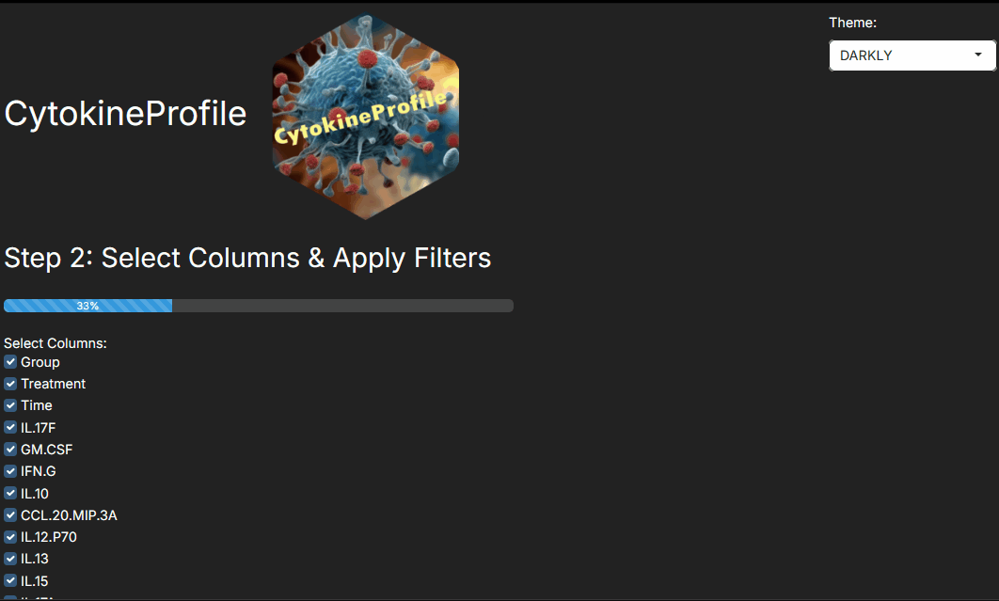
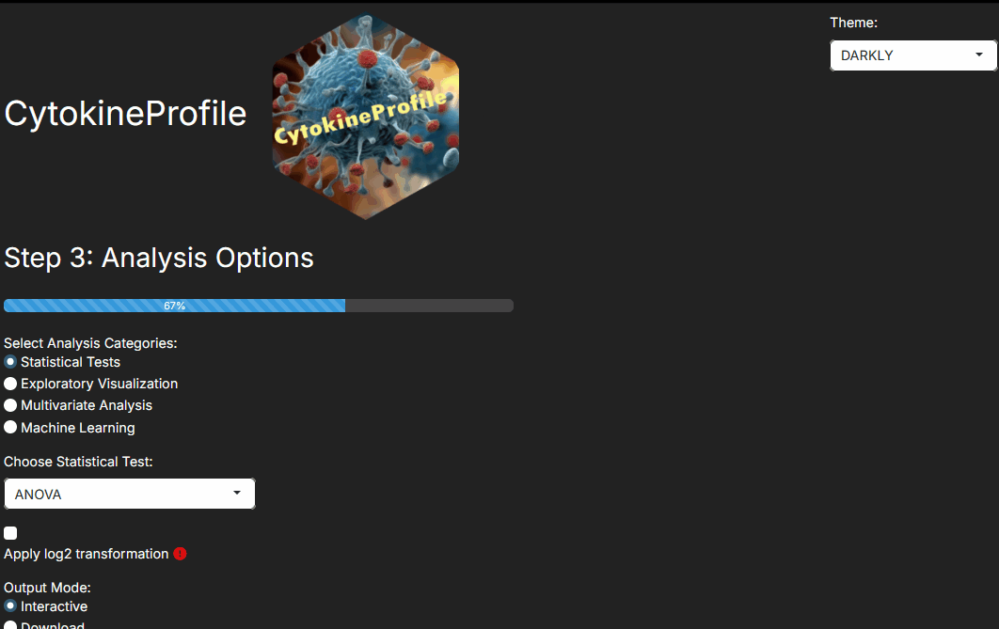

# Basic Tutorial of CytokineProfile Shiny

This guide walks through the main workflow of CytokineProfile Shiny with
an app-user focus. The goal is not only to show which step comes next,
but also what you are deciding at each stage and how those choices
affect the results you see later.

## What the app helps you decide

CytokineProfile Shiny is organized like a workflow:

1.  Upload and inspect the data.
2.  Decide which samples and variables should be included.
3.  Choose the type of analysis that matches your question.
4.  Adjust only the arguments that materially change interpretation.
5.  Review the results and export the figures or report.

If you are new to the app, a useful rule of thumb is:

- Start with exploratory plots when you want to understand spread, group
  differences, or unusual samples.
- Use univariate methods when your main question is whether a specific
  cytokine differs between groups.
- Use multivariate or machine-learning methods when your question is
  about overall profiles, separation between groups, or feature
  selection.

## Step 1: Uploading and viewing data

The app supports common tabular formats such as CSV, XLS/X, and TXT. It
also includes example datasets so you can learn the workflow before
analyzing your own data.

At this step, your main job is to confirm that the dataset loaded the
way you expect:

- Are group labels, treatment labels, batch labels, or subject IDs
  present and correctly spelled?
- Are cytokine measurements being interpreted as numeric values?
- Do the summary statistics look plausible, or do you already see
  missing values, strong skewness, or obvious outliers?

This early check matters because every later step depends on the columns
being recognized correctly.

## Step 2: Selecting columns and applying filters

Step 2 is where you define the dataset that will actually be analyzed.
This is often the most important decision point in the whole workflow.

Use this step to:

- Keep the grouping and design columns needed for the analysis.
- Remove variables that are not relevant to the current question.
- Filter the dataset to the specific groups, treatments, or study
  subsets you want to compare.
- Exclude samples only when you have a clear reason, such as failed
  quality control or a predefined exclusion rule.

The live data preview is especially helpful here. It lets you verify
that the app is analyzing the samples and categories you intended before
you move on.

As a practical rule:

- If you filter to two groups, methods such as volcano plots, binary
  classification, and pairwise univariate testing become easier to
  interpret.
- If you keep multiple groups, methods such as PCA, sPLS-DA, heatmaps,
  and multi-level univariate analysis are often more informative.

## Step 3: Choosing the analysis family

Step 3 answers the question, “What kind of evidence do I want from this
dataset?”

Common choices are:

- Exploratory visualizations when you want to inspect distributions,
  fold changes, correlations, or clustering patterns.
- Univariate testing when you want cytokine-by-cytokine statistical
  comparisons.
- Multivariate methods when you want to understand separation across the
  whole cytokine profile.
- Machine-learning methods when prediction performance and variable
  importance are central to the question.

When deciding among them, it helps to think in terms of interpretation:

- A volcano plot emphasizes effect size plus p-value for two-group
  comparisons.
- A dual-flashlight plot emphasizes fold change plus SSMD effect size
  thresholds.
- PCA shows unsupervised structure without using class labels to force
  separation.
- sPLS-DA, Random Forest, and XGBoost are supervised and therefore
  require more care to avoid over-interpreting apparent separation.

## Step 4: Choosing the arguments that matter

Step 4 exposes the method-specific controls. You do not need to tune
every field for every analysis. Focus first on the arguments that change
interpretation.

Examples:

- Threshold arguments change which points are highlighted or labeled in
  volcano and dual-flashlight plots.
- Transformation or scaling options change how features are compared
  across plots and models.
- Component counts and selected variable counts affect how multivariate
  methods summarize the data.
- Validation settings such as ROC, cross-validation, train/test splits,
  and fold counts affect how much confidence you should place in
  supervised model performance.

If you are unsure where to start, begin with the default settings,
inspect the outputs, and only then change one argument at a time. That
makes it much easier to understand what the setting is actually doing.

## Step 5: Producing and reading results

After an analysis is run, the results panel becomes the place where you
decide whether the output is convincing, exploratory, or inconclusive.

When reading the results:

- Look at the figure and the summary together rather than relying on one
  metric alone.
- Ask whether the strongest-looking findings are also biologically
  large, not only statistically or visually prominent.
- For supervised methods, pay attention to validation outputs before
  trusting the apparent group separation.
- Use export only after confirming that the filtered dataset, method
  choice, and settings are the ones you intended to report.

The built-in PDF export is useful once you have settled on a result
worth saving.

## What to read next

After this overview, the next useful articles are:

- [Understanding Volcano
  Plot](https://shinyinfo.cytokineprofile.org/articles/Understanding-Volcano-Plot.md)
  for two-group differential patterns.
- [Understanding Univariate Test
  Selection](https://shinyinfo.cytokineprofile.org/articles/Understanding-Univariate-Test-Selection.md)
  for choosing the right testing workflow.
- [Understanding Boxplots and Violin
  Plots](https://shinyinfo.cytokineprofile.org/articles/Understanding-Boxplots-and-Violin-Plots.md)
  for inspecting raw distributions before formal testing.
- [Understanding Dual-Flashlight
  Plot](https://shinyinfo.cytokineprofile.org/articles/Understanding-Dual-Flashlight-Plot.md)
  for threshold-based effect-size screening.
- [Understanding
  PLSR](https://shinyinfo.cytokineprofile.org/articles/Understanding-PLSR.md)
  for predicting a numeric outcome from many cytokines.
- [Understanding
  (s)PLS-DA](https://shinyinfo.cytokineprofile.org/articles/Understanding-sPLS-DA.md)
  for supervised multivariate discrimination.
- [Understanding MINT
  sPLS-DA](https://shinyinfo.cytokineprofile.org/articles/Understanding-MINT-sPLS-DA.md)
  for multi-batch supervised discrimination.
- [Understanding Random
  Forest](https://shinyinfo.cytokineprofile.org/articles/Understanding-Random-Forest.md)
  and [Understanding
  XGBoost](https://shinyinfo.cytokineprofile.org/articles/Understanding-XGBoost.md)
  for classification-focused workflows.

------------------------------------------------------------------------

*Last updated:* April 28, 2026
