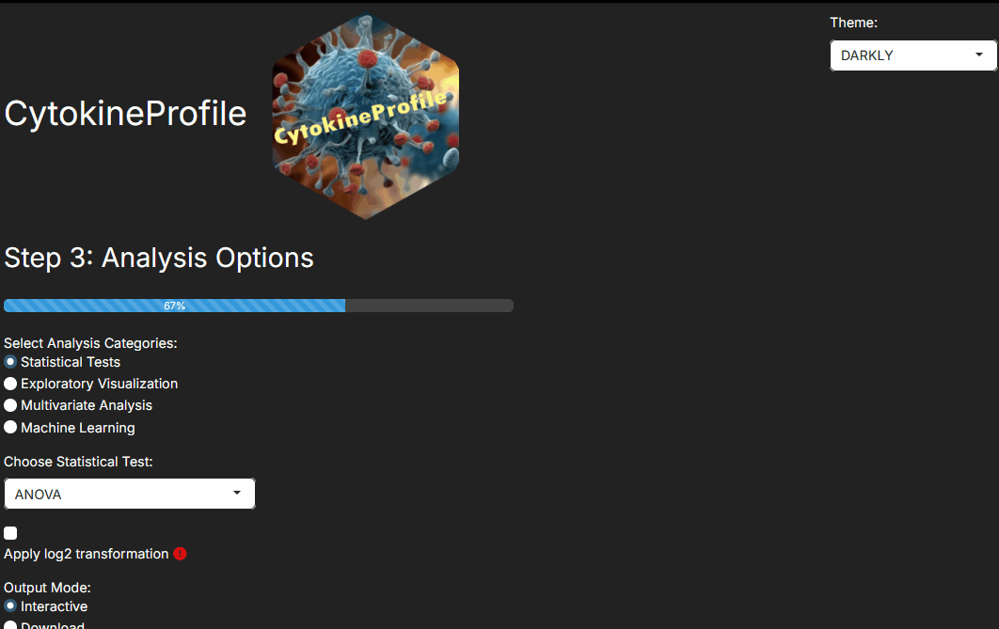

# Basic Tutorial of CytokineProfile Shiny

This guide will provide the basic steps to use CytokineProfile Shiny.

## Uploading and Viewing Data

The app allows users to upload their own data and supports various
formats such as CSV, XLS/X, and TXT. There is also built-in datasets for
testing and understanding the app. Additionally, the app offers the
option to view the data set and also view summary statistics which may
provide useful information about the data prior to conducting analysis.

## Selecting Columns and Applying Filters

In step 2 of the app, the user is provided with a list of columns
available within the uploaded data to select or deselect variables of
choice and also filter categorical variables. There is also a live view
of the filtered data set after applying the selections and filters which
updates as changes are made to your data prior to running analysis.
Lastly, users can select specific rows to exclude from the analysis
which is then seen in the deleted samples table where users can also
undo the deletion of samples.

## Selecting Analysis Types

In step 3 and step 4 of the app, the user is given selection of
different analyses to choose from each with its special parameters to
configure in order to obtain specific statistical metrics or
visualizations.

## Producing Results

After selecting the analysis type, the results are produced and
displayed within the app. There is an option to download the results in
PDF format as well with a file name that is provided by the user.

------------------------------------------------------------------------

*Last updated:* December 11, 2025
