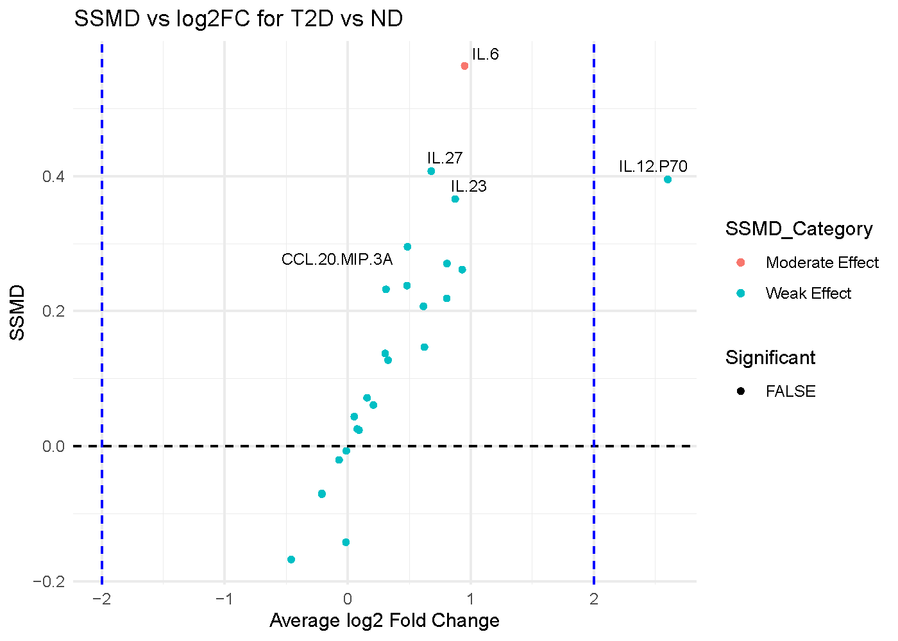

# Understanding Dual-Flashlight Plot

## When to use a dual-flashlight plot

The dual-flashlight plot is useful when you want to screen for cytokines
that show both a meaningful fold change and a meaningful effect size
threshold. In CytokineProfile Shiny, it is best treated as a
prioritization plot rather than as a formal hypothesis-testing figure.

## What the app is showing

The example below compares subjects with Type 2 Diabetes (T2D) against
Non-Diabetic (ND) subjects.

### The axes

- X-axis: Average log2 fold change (`log2FC`) Positive values indicate
  higher abundance in one group, and negative values indicate lower
  abundance.
- Y-axis: Strictly standardized mean difference (`SSMD`) SSMD is an
  effect-size measure that combines mean difference and within-group
  variability. Larger absolute values indicate stronger group
  separation.

### The visual cues

- Each point is one cytokine.
- The vertical dashed lines mark the user-chosen `log2FC` threshold.
- The highlighted points are the cytokines that cross both the `SSMD`
  threshold and the `log2FC` threshold.
- The labels usually identify the strongest hits according to the
  ranking criterion used in the app.

## Which app arguments matter most

The most important controls are:

- `Comparison Column`: decides which categorical variable defines the
  comparison.
- `Condition 1` and `Condition 2`: decide which two levels are
  contrasted in the plot.
- `SSMD Threshold`: controls how large the effect size must be before a
  point is treated as a notable hit.
- `Log2 Fold Change Threshold`: controls how large the fold change must
  be.
- `Top Labels`: controls how many of the top-ranked cytokines are
  labeled.

These thresholds are not cosmetic. They determine which cytokines get
emphasized, so they should be set intentionally and reported clearly.

## How to interpret the figure

A dual-flashlight plot is easiest to read in terms of agreement between
the two axes:

- Points far from zero on the x-axis have larger fold changes.
- Points high on the y-axis have stronger SSMD effect sizes.
- Points that cross both thresholds are often the most compelling
  screening candidates.
- Points with strong SSMD but small fold change may be consistent yet
  not large in magnitude.
- Points with large fold change but weak SSMD may reflect unstable or
  variable signals.

For the example shown:

- A point in the far upper-left region would represent a cytokine with a
  large negative fold change and a strong effect size.
- A point near the center horizontally but high vertically would suggest
  consistent separation without a large fold change.
- A point far left or right but not high on SSMD should be treated more
  cautiously because the magnitude of change is not matched by equally
  strong standardized separation.

## Common cautions

The most important caution is conceptual:

- This plot is not driven by p-values.
- A highlighted point is a threshold-based hit, not automatically a
  statistically significant result.

That makes the plot very useful for screening, but it should be paired
with univariate testing or direct inspection of the raw data when you
want inferential evidence.

Additional cautions:

- Threshold choice strongly affects which points look important.
- Very small sample sizes can make both fold change and SSMD less
  stable.
- The direction of the fold change depends on the group ordering, so
  always confirm which group is treated as the reference.

## How to reproduce the result in the app

1.  Filter the dataset to the two groups you want to compare.
2.  Choose `Dual-Flashlight Plot`.
3.  Select `Comparison Column`, `Condition 1`, and `Condition 2`.
4.  Set `SSMD Threshold`, `Log2 Fold Change Threshold`, and
    `Top Labels`.
5.  Review the highlighted cytokines as prioritized candidates for
    follow-up.

### App walkthrough

------------------------------------------------------------------------

*Last updated:* April 02, 2026
