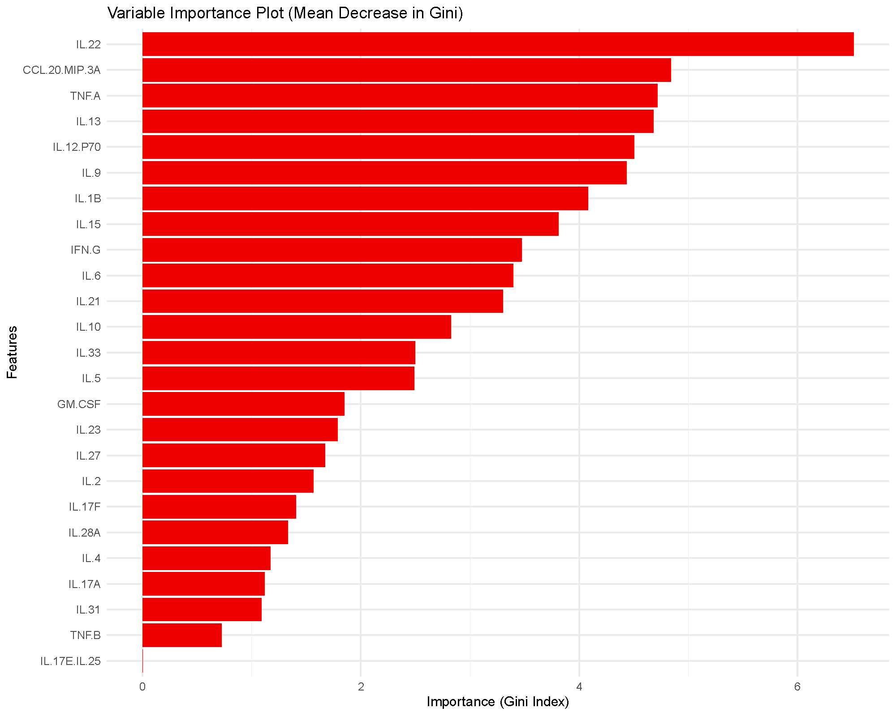
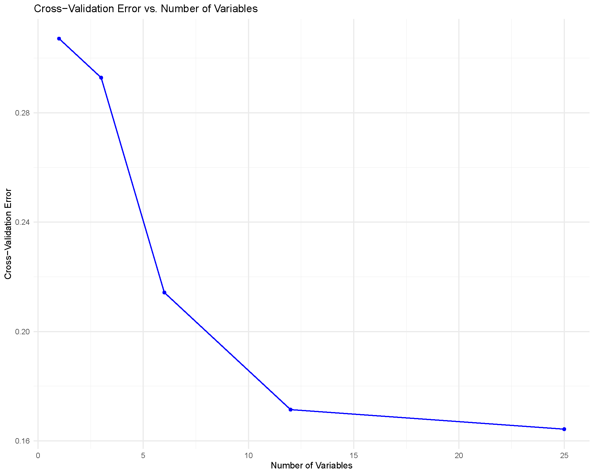

# Understanding-Random-Forest

## Random Forest

Random Forest is an ensemble of decision trees that averages many
randomized trees to reduce variance and improve prediction accuracy.
This page shows how to interpret the key plots produced by the app and
how to reproduce them.

## Example Results

For this brief interpretation tutorial, we will use the results
generated by filtering the `ExampleData1` dataset built into the
application and only including subjects with Pre-Diabetes (PreT2D) and
Type 2 Diabetes (T2D). Summary of the model is not covered in this
tutorial however, the summary tab within the results provides confusion
matrices on the training and testing set to evaluate how the model
performed when classifying the two different groups.

### Variable Importance Plot based on Mean Decrease in Gini Index

The bars rank the variables (cytokines in our case) by how much they
reduce node impurity across the forest. Higher bars imply greater
influence on the model’s splits. There is no specific cutoff value that
helps determine which variables are the most important, however we can
still see that IL-122, CCL-20/MIP-3A, TNF-A and a few other cytokines
have have a mean decrease in Gini \> 4. These cytokines would be
considered to be more influential than TNF-B and IL-31 for example.

### Receiver Operating Characteristic (ROC) Curve and Area Under the Curve (AUC)

The ROC curve and AUC value is a great way to evaluate the model’s
performance as the curve plots the true positive rate (sensitivity)
against the false positive rate (1-specificity). The AUC value provides
a single measure of a model’s ability to classify the groups being
compared, with values closer to 1 indicating better performance.

In our example analysis, we achieved an AUC of 0.93 that would show that
the model performed really well when classifying subjects with PreT2D
vs. T2D based on the cytokines as predictors.

### Cross-Validation Performance

In the cross-validation for Random Forest, each point is a model refit
with a smaller feature set and error is estimated with K‑fold CV. We
look for the elbow where error stops improving meaningfully as variables
increase and based on that pick a compact subset near that elbow. In our
case, ≈ 12 variables or more would give us a low error rate in
classification meaning we would see a higher accuracy in classification
as the model is able to perform well and differentiate between the two
compared groups.

### Below is a short animation on how to obtain the same result from the application:

To briefly describe the arguments:

- Number of Trees: How many trees the forest grows. More trees will
  usually stabilize performance.
- Number of Variables to Split: How many variables the tree is allowed
  to consider at each split. Smaller number means more diverse trees;
  larger number means stronger individual trees but more similar to each
  other. A common default number would be roughly the square-root of the
  total number of features. For example, if we have 25 variables, we
  would enter 5 and adjust based on the results including
  cross-validation results.
- Train Fraction: How the dat are split into train and test sets. It
  requires a percentage between 0.1-0.9, so for example entering 0.7,
  70% of the inputted data would be split into training and the
  remaining 30% will be used for testing.
- Number of Folds: the number of folds used in k-fold cross-validation
  when running random forest cross-validation (RFCV).
- Step Size: This controls how aggressively variables are pruned between
  the steps when RFCV is running. For example, with a step size of 0.5,
  the variable count is approximately halved at each step.

------------------------------------------------------------------------

*Last updated:* December 11, 2025
