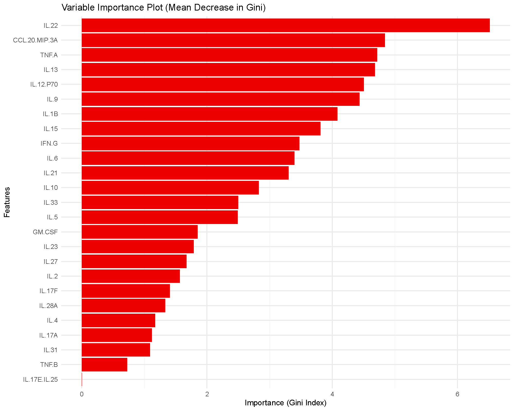
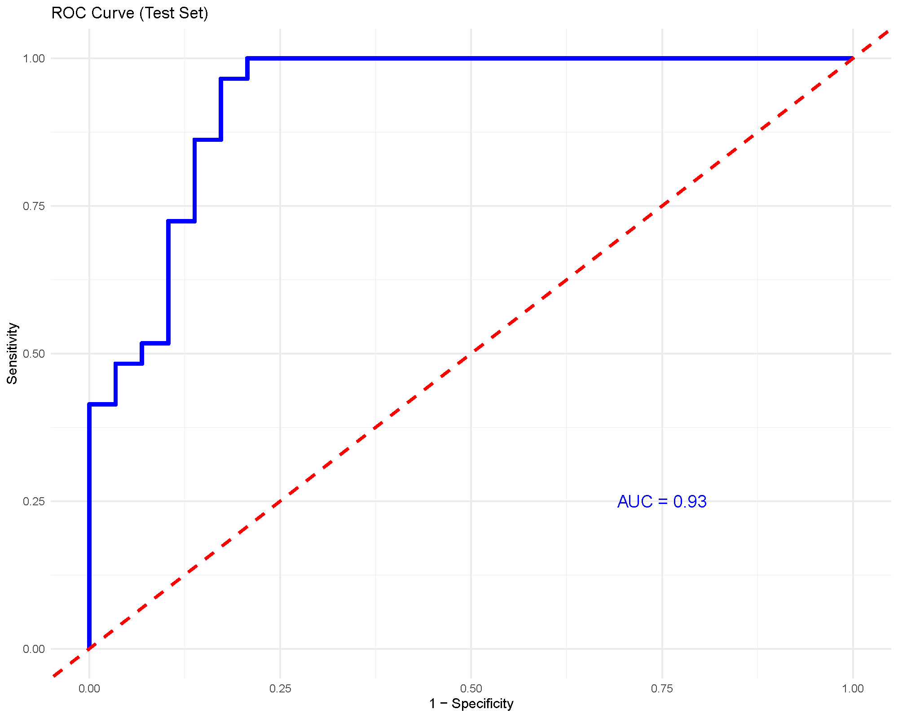
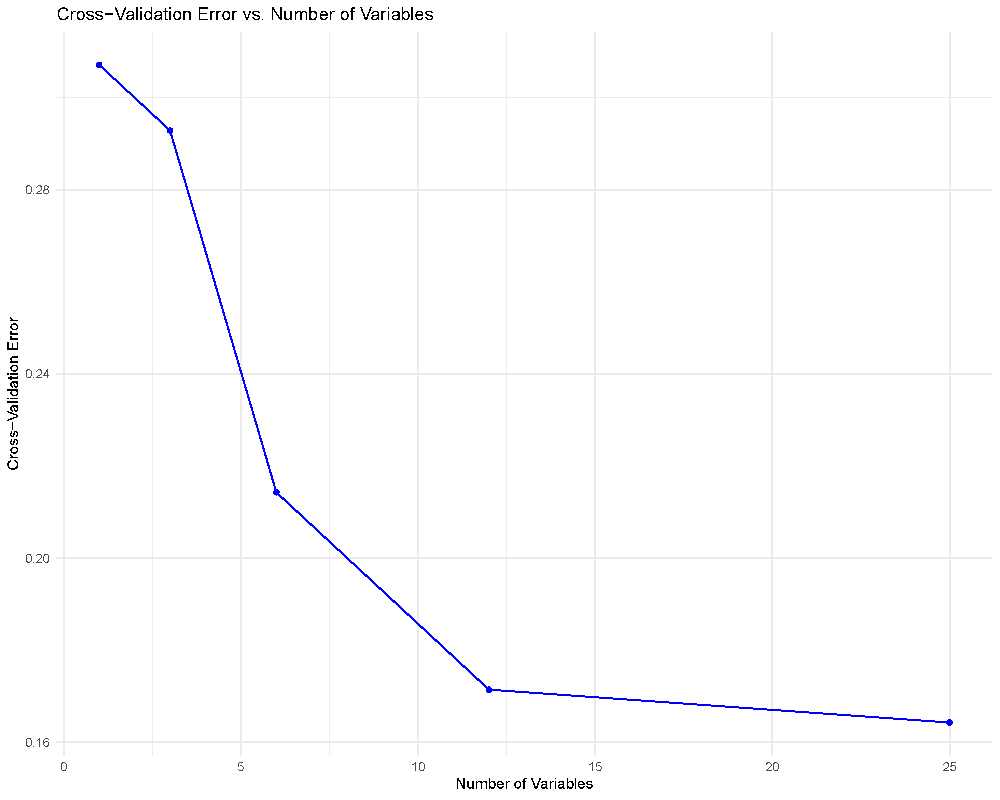

# Understanding Random Forest

## When to use Random Forest

Random Forest is a supervised classification method that works well when
you want a robust nonlinear classifier and a ranked view of feature
importance. It is often a good first machine-learning method because it
usually performs well with minimal tuning compared with more sensitive
boosting methods.

## When not to use Random Forest

Random Forest is usually not the best first choice when:

- the outcome is numeric rather than categorical
- you need an unsupervised view of structure before building a
  classifier
- the dataset is too small for a meaningful train/test or validation
  workflow

## Example context

This example uses the `ExampleData1` dataset after filtering to subjects
with Pre-Diabetes (PreT2D) and Type 2 Diabetes (T2D).

## Which app arguments matter most

The highest-value settings to understand are:

- `Grouping Column`: defines the classes the model is trying to predict.
- `Number of Trees`: affects model stability and runtime.
- `Number of Variables to Split`: controls how many predictors are
  considered at each tree split.
- `Train Fraction`: determines how much data is used for training versus
  held-out testing.
- `Plot ROC (Binary Comparison Only)`: adds an ROC view when the
  comparison has exactly two classes.
- `Run RFCV`, `Number of Folds`, and `Step Size`: control the
  feature-selection cross-validation view.

For app users, the safest workflow is to change one of these at a time
and then check whether the held-out or cross-validated performance is
improving in a meaningful way.

## What outputs matter most

### Variable importance plot

The bars rank cytokines by how much they reduce node impurity across the
forest. Higher bars indicate greater influence on the fitted model, but
they do not provide a formal statistical test or a universal cutoff.

In practice, this plot is most useful for prioritization. Cytokines near
the top of the ranking are the ones the model relied on more heavily for
classification.

### ROC and AUC

For binary classification, the ROC curve shows the tradeoff between
sensitivity and specificity across thresholds. The AUC summarizes how
well the model separates the two groups overall.

An AUC around 0.93, as shown here, suggests strong discrimination in
this particular comparison. Even so, it should still be considered
together with the train/test split and any cross-validation output.

### RFCV feature-selection curve

This plot helps answer a practical question: how many cytokines do we
need before classification error stops improving much?

The usual reading strategy is to look for an elbow or plateau. If the
error rate stops improving meaningfully after a modest number of
variables, that smaller feature set may be preferable because it is
easier to interpret and report.

## Common cautions

Important limits to keep in mind:

- Variable importance is not the same thing as statistical significance.
- Very strong training performance can still coexist with weaker test
  performance.
- Small datasets can make train/test splits unstable, so rerunning with
  the same seed or checking cross-validation outputs is useful.
- If class balance is poor, accuracy alone can be misleading.

## Practical guidance for the main arguments

- Number of Trees: increase this if the importance ranking or
  performance looks unstable between runs.
- Number of Variables to Split: start near the default behavior, then
  adjust only if performance is clearly underwhelming.
- Train Fraction: larger training sets can improve fitting, but they
  leave less held-out data for honest checking.
- Number of Folds: more folds can give a steadier validation estimate,
  but they also cost more computation.
- Step Size: smaller steps make RFCV more granular, while larger steps
  make it faster but coarser.

## How to reproduce the result in the app

1.  Filter the dataset to the classes you want to compare.
2.  Choose `Random Forest`.
3.  Set `Grouping Column`, `Number of Trees`,
    `Number of Variables to Split`, and `Train Fraction`.
4.  Turn on `Plot ROC (Binary Comparison Only)` and `Run RFCV` if you
    want stronger validation context.
5.  Read the variable importance plot together with the summary and
    validation outputs.

### App walkthrough

## What to read next

Related articles:

- [Understanding
  XGBoost](https://shinyinfo.cytokineprofile.org/articles/Understanding-XGBoost.md)
  for a more tuning-sensitive boosting alternative.
- [Understanding
  (s)PLS-DA](https://shinyinfo.cytokineprofile.org/articles/Understanding-sPLS-DA.md)
  for supervised multivariate separation with interpretable latent
  components.
- [Understanding Boxplots and Violin
  Plots](https://shinyinfo.cytokineprofile.org/articles/Understanding-Boxplots-and-Violin-Plots.md)
  when top-ranked features need raw-distribution follow-up.

------------------------------------------------------------------------

*Last updated:* April 06, 2026
