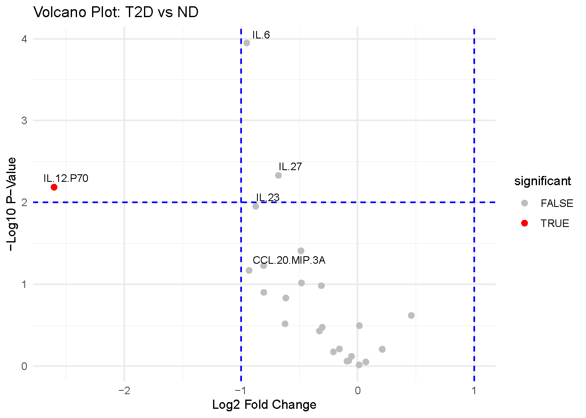

# Understanding Volcano Plot

## When to use a volcano plot

A volcano plot is most useful when you are comparing two groups and want
to see both magnitude of change and statistical evidence at the same
time. In CytokineProfile Shiny, it is a fast way to identify cytokines
that look both biologically large and statistically notable in the same
figure.

## When not to use a volcano plot

A volcano plot is usually not the best fit when:

- you want to compare more than two groups in one workflow
- your emphasis is threshold-based effect-size screening rather than
  p-values
- you need raw distribution context for a small set of cytokines rather
  than broad screening

## What the app is showing

The example below compares subjects with Type 2 Diabetes (T2D) against
Non-Diabetic (ND) subjects.

### The axes

- X-axis: Average log2 fold change (`log2FC`) Positive values indicate
  higher abundance in the first condition of the comparison, while
  negative values indicate lower abundance.
- Y-axis: `-log10(p-value)` Larger values indicate smaller p-values.
  Points higher on the plot therefore have stronger statistical evidence
  against no difference.

### The visual cues

- Each point is one cytokine.
- The vertical dashed lines mark the fold-change threshold. In this
  example, `log2FC = -1` and `log2FC = 1` correspond to a 2-fold
  decrease or increase.
- The horizontal dashed line marks the p-value threshold. In this
  example, `-log10(p-value) = 2`, which corresponds to `p = 0.01`.

## Which app arguments matter most

The main settings to pay attention to are:

- `Comparison Column`: decides which categorical variable defines the
  two groups being compared.
- `Condition 1` and `Condition 2`: decide which two levels of that
  column are contrasted.
- `Log2 Fold Change Threshold`: determines how large a change must be
  before you visually treat it as biologically substantial.
- `P-Value Threshold`: controls the statistical evidence cutoff.
- `Top Labels`: affects readability only. It changes how many of the
  strongest points get labeled, not the underlying calculations.

A good workflow is to set the comparison first, keep the default
thresholds, and then tighten or relax the thresholds only if you have a
clear reporting reason.

## How to interpret the figure

The most interpretable points are usually the ones in the upper corners:

- Upper right: large positive fold change and strong statistical
  evidence.
- Upper left: large negative fold change and strong statistical
  evidence.
- Center but high: statistically detectable changes that may be too
  small to matter biologically.
- Far left or far right but low: large fold changes that may be
  unstable, noisy, or underpowered.

For this example figure:

- Cytokines in the upper-left region are the strongest candidates for
  lower abundance in T2D relative to ND.
- Cytokines in the upper-right region would be candidates for higher
  abundance in T2D relative to ND.
- Points above the horizontal line but between the vertical lines should
  be read as statistically supported but modest in magnitude.
- Points outside the vertical lines but below the horizontal line may
  still be interesting for follow-up, but they should not be treated as
  strong differential findings on statistical grounds alone.

The key idea is that a volcano plot rewards agreement between effect
size and p-value. A point that looks strong on only one of those
dimensions deserves more caution.

## Common cautions

Keep these limits in mind when reading volcano plots:

- The p-values come from repeated two-group testing, so
  multiple-comparison context still matters even when the figure is
  visually intuitive.
- Fold change can look large when sample sizes are small or group
  variability is high.
- A volcano plot is best for two-group comparisons. If you want to
  compare three or more groups together, other methods are often more
  informative.
- This figure helps prioritize candidates; it does not replace checking
  the raw distributions.

## How to reproduce the result in the app

1.  Load a dataset and filter it to the two groups you want to compare.
2.  Choose `Volcano Plot`.
3.  Select `Comparison Column`, `Condition 1`, and `Condition 2`.
4.  Adjust `Log2 Fold Change Threshold`, `P-Value Threshold`, and
    `Top Labels` only if needed.
5.  Review the highlighted points together with the labels and any
    follow-up plots.

### App walkthrough

## What to read next

Related articles:

- [Understanding Dual-Flashlight
  Plot](https://shinyinfo.cytokineprofile.org/articles/Understanding-Dual-Flashlight-Plot.md)
  for threshold-based effect-size screening without p-value emphasis.
- [Understanding Error-Bar
  Plots](https://shinyinfo.cytokineprofile.org/articles/Understanding-Error-Bar-Plot.md)
  for compact group summaries.
- [Understanding Boxplots and Violin
  Plots](https://shinyinfo.cytokineprofile.org/articles/Understanding-Boxplots-and-Violin-Plots.md)
  for distribution-level follow-up on prioritized hits.

------------------------------------------------------------------------

*Last updated:* April 07, 2026
