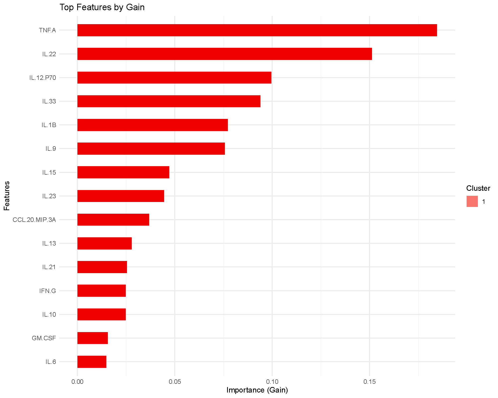
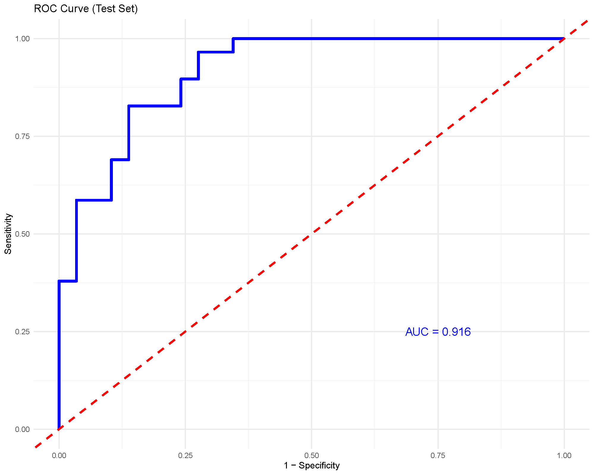

# Understanding XGBoost

## When to use XGBoost

XGBoost is a supervised boosting method that builds many trees in
sequence, with each new tree trying to correct mistakes made by the
earlier ones. It is often useful when you want a highly flexible
classifier and are willing to pay more attention to tuning and
validation than you would for Random Forest.

## When not to use XGBoost

XGBoost is usually not the best first choice when:

- you want the simplest robust baseline classifier rather than an
  aggressively tuned one
- the dataset is small enough that tuning instability is a major concern
- the outcome is numeric rather than categorical

## Example context

This example uses the `ExampleData1` dataset after filtering to subjects
with Pre-Diabetes (PreT2D) and Type 2 Diabetes (T2D).

## Which app arguments matter most

The arguments that most affect interpretation are:

- `Grouping Column`: defines the classes the model is trying to predict.
- `Train Fraction`: controls how much data is kept for model training
  versus held-out testing.
- `Number of Rounds`: controls how long boosting continues.
- `Maximum Depth`: controls how complex each tree can become.
- `Learning Rate`: controls how aggressively each round updates the
  model.
- `Evaluation Metric`: determines what the training process tries to
  optimize.
- `Top Number of Features`: changes how many ranked features are shown
  in the importance display.
- `Plot ROC (Binary Only)`, `Cross-Validation`, and `Number of Folds`:
  control how much validation context you get when judging model
  performance.

These settings interact with one another. For example, a lower learning
rate often needs more boosting rounds, while deeper trees may improve
fit at the cost of overfitting.

## What outputs matter most

### Feature importance by gain

The importance plot ranks features by gain, which measures how much
splits using that feature improved the training objective across the
boosted trees.

This is a model-based importance score, so it is best read as “what the
classifier relied on most,” not as a formal statistical ranking.

### ROC and AUC

For binary classification, the ROC curve and AUC provide a compact
summary of discrimination performance. An AUC around 0.92, as shown
here, suggests strong separation between the two groups in this example.

As with any supervised method, this should still be interpreted together
with the validation strategy and the size of the held-out test set.

## Common cautions

XGBoost is powerful, but it is also easier to overfit than simpler
methods if the tuning becomes too aggressive.

Watch especially for:

- very deep trees
- many rounds without adequate validation
- strong training performance with much weaker held-out performance
- unstable conclusions from very small datasets

When in doubt, use cross-validation and a conservative learning rate
rather than pushing the model to fit as tightly as possible.

## Practical guidance for the main arguments

- Number of rounds: more rounds let the model learn longer, but only
  help if validation supports the extra complexity.
- Learning Rate: lower values are often safer, but they usually require
  more rounds.
- Maximum Depth: deeper trees capture more interactions but overfit more
  easily.
- Evaluation Metric: choose a metric that matches the study design.
  `auc` is natural for binary classification, while `mlogloss` is often
  more appropriate for multiclass settings.
- Train Fraction and Cross-Validation: these settings determine how
  honestly the model is being checked on unseen data.
- Top Number of Features: use this to improve readability of the
  importance plot, not to tune the model itself.

## How to reproduce the result in the app

1.  Filter the dataset to the classes you want to compare.
2.  Choose `Extreme Gradient Boosting (XGBoost)`.
3.  Start with moderate values for `Number of Rounds`, `Learning Rate`,
    and `Maximum Depth`.
4.  Enable `Cross-Validation` or `Plot ROC (Binary Only)` when
    available.
5.  Read the importance and performance outputs together before drawing
    biological conclusions.

### App walkthrough

## What to read next

Related articles:

- [Understanding Random
  Forest](https://shinyinfo.cytokineprofile.org/articles/Understanding-Random-Forest.md)
  for a simpler and often more stable first classifier.
- [Understanding
  (s)PLS-DA](https://shinyinfo.cytokineprofile.org/articles/Understanding-sPLS-DA.md)
  for a supervised latent-component alternative.
- [Understanding Boxplots and Violin
  Plots](https://shinyinfo.cytokineprofile.org/articles/Understanding-Boxplots-and-Violin-Plots.md)
  when important features need raw-distribution follow-up.

------------------------------------------------------------------------

*Last updated:* April 09, 2026
