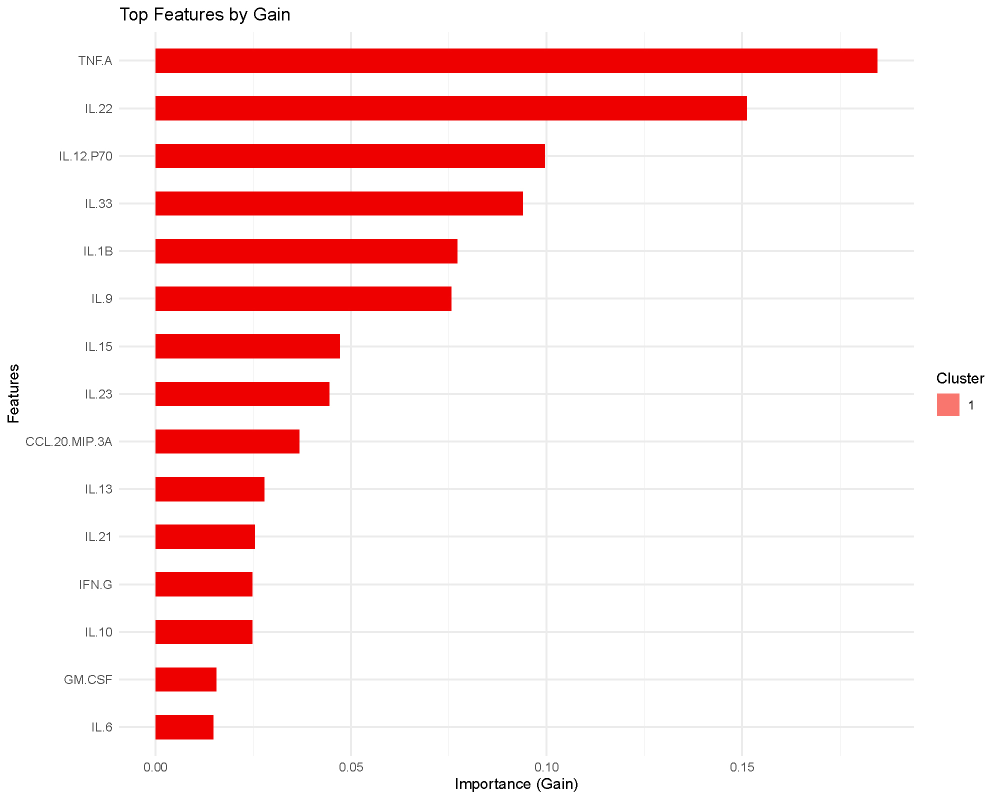

# Understanding-XGBoost

## Extreme Gradient Boosting (XGBoost)

Extreme Gradient Boosting (XGBoost) is a tree‑based boosting method that
builds many shallow trees in sequence, where each new tree corrects
mistakes of the ensemble so far. This page shows how to interpret the
key plots produced by the app and how to reproduce them.

## Example Results

For this brief interpretation tutorial, we will use the results
generated by filtering the `ExampleData1` dataset built into the
application and only including subjects with Pre-Diabetes (PreT2D) and
Type 2 Diabetes (T2D). Summary of the model is not covered in this
tutorial however, the summary tab within the results provides confusion
matrices on the training and testing set to evaluate how the model
performed when classifying the two different groups.

### Variable Importance Plot based Gain

The bars rank the variables (cytokines in our case) by improvement in
loss attributed to splits using that feature averaged across the trees.
Higher bars imply greater contribution or influence on the model’s
splits. In our example, we can see TNF-A and IL-22 being the highest
contribution to the model in classification.

### Receiver Operating Characteristic (ROC) Curve and Area Under the Curve (AUC)

The ROC curve and AUC value is a great way to evaluate the model’s
performance as the curve plots the true positive rate (sensitivity)
against the false positive rate (1-specificity). The AUC value provides
a single measure of a model’s ability to classify the groups being
compared, with values closer to 1 indicating better performance.

In our example analysis, we achieved an AUC of 0.92 that would show that
the model performed really well when classifying subjects with PreT2D
vs. T2D based on the cytokines as predictors.

### Below is a short animation on how to obtain the same result from the application:

To briefly describe the arguments:

- Number of Rounds: the number of boosting iterations—each round adds a
  new tree to correct what the previous trees missed. If we have a lower
  learning rate, then we would need more rounds.
- Learning Rate: scales down every tree’s contribution to keep boosting
  conservative (prevents overfitting). The range should be between 0–1.
  Lower rate =sturdier but slower training which should be paired with a
  larger number of rounds.
- Maximum Depth: the deepest a tree is allowed to grow. Deeper trees fit
  more interactions but are more likely to overfit; shallow trees
  generalize better. Default number is set to 6 but can be adjusted for
  larger datasets or to obtain better performance results.
- Evaluation Metric: evaluation metrics for validation data to determine
  how well the model is learning on new data.
  - mlogloss: this is used for ≥ 3 categories which provides a score
    where lower is better as it heavily penalizes the model for being
    “confidently wrong”.
  - auc: this is used more for binary comparisons or only 2 categories
    which provides a score where higher is better with 1.0 being perfect
    classification.
- Train Fraction: how much data is used for training vs testing (e.g.,
  0.7 = 70% train / 30% test).
- Cross-Validation + Number of Folds: K-fold CV to estimate
  generalization while you tune rounds/learning rate/ maximum depth.
- Top Number of Features: only controls how many variables appear in the
  “Top Features by Gain” chart; it doesn’t change the fitted model.
  “Gain” = each feature’s fractional contribution to improving the loss
  across all its splits

------------------------------------------------------------------------

*Last updated:* December 12, 2025
