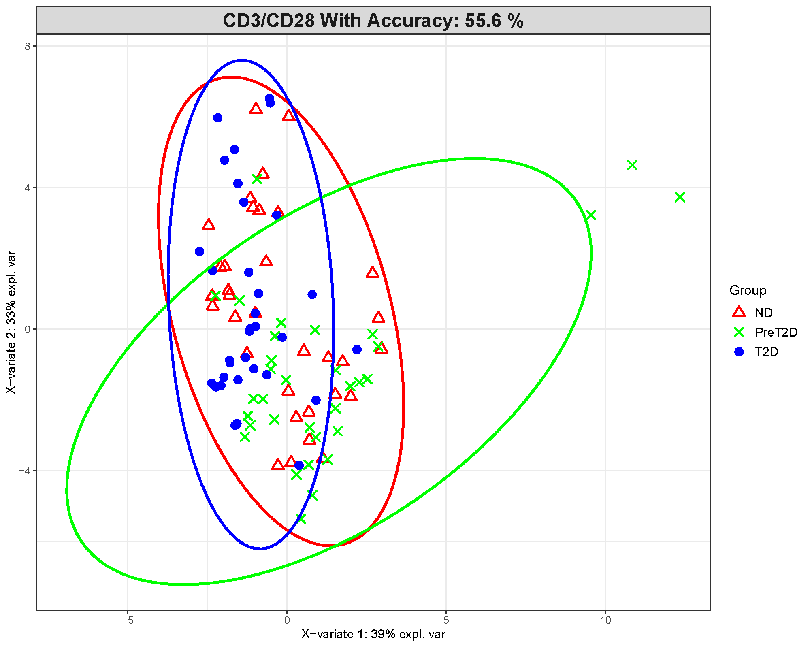
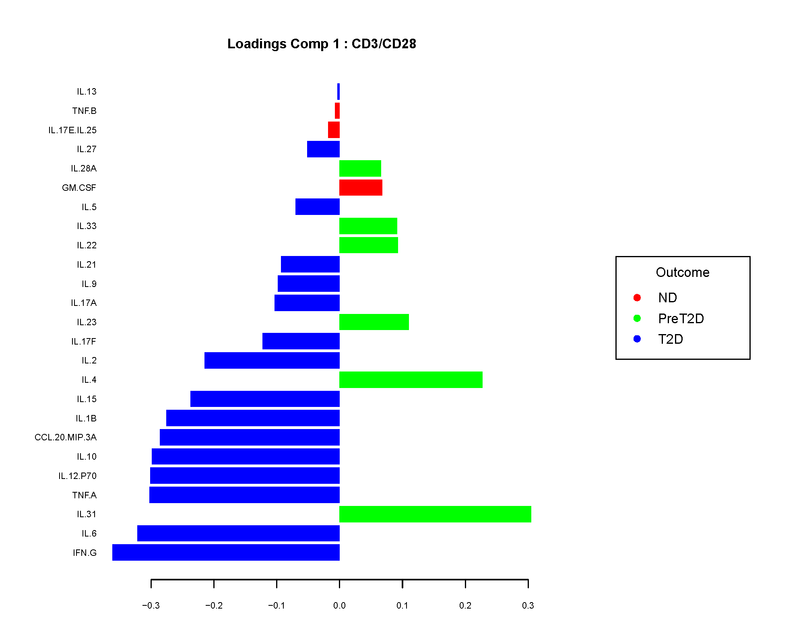
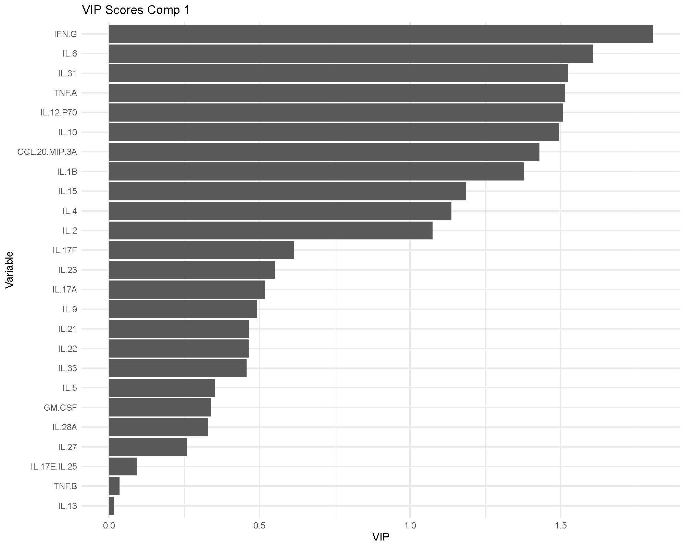
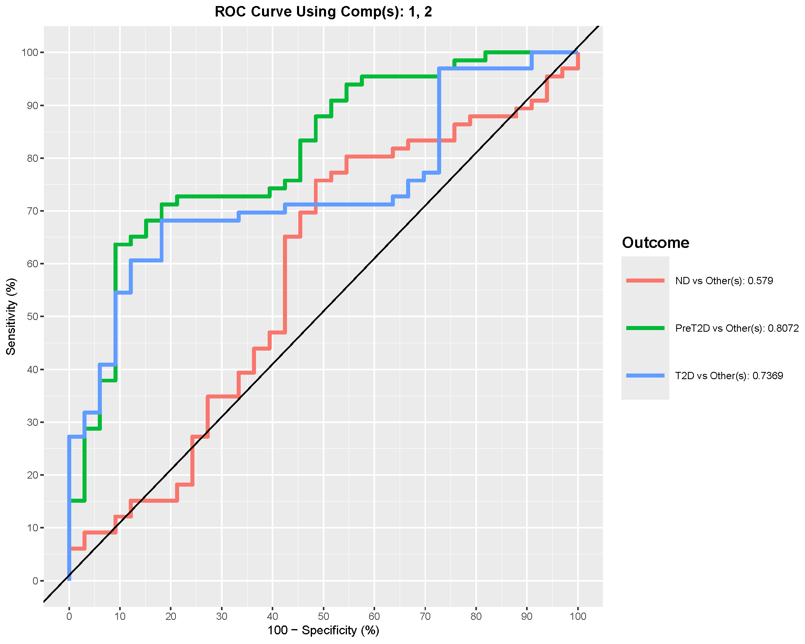
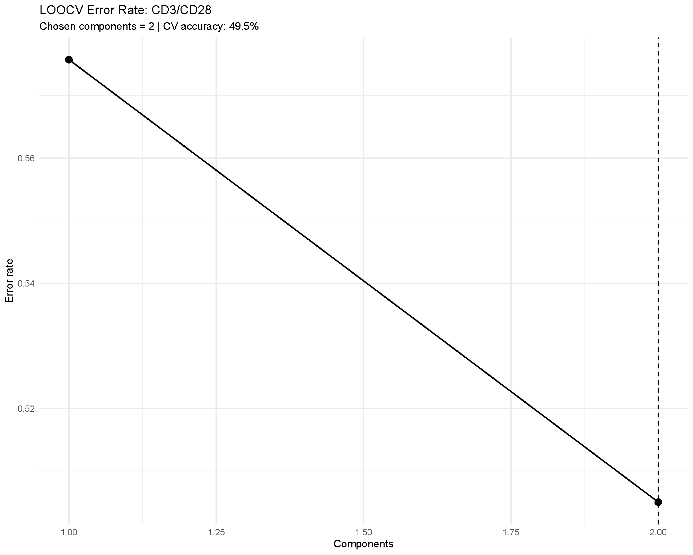

# Understanding (s)PLS-DA

## When to use (s)PLS-DA

Sparse Partial Least Squares Discriminant Analysis, or sPLS-DA, is a
supervised multivariate method. It is useful when your goal is to see
whether whole cytokine profiles separate predefined groups and which
features drive that separation.

Because the method uses the class labels directly, it is more powerful
for discrimination than unsupervised methods such as PCA, but it also
requires more caution when interpreting apparent separation.

## When not to use (s)PLS-DA

sPLS-DA is usually not the best first choice when:

- the response is numeric rather than categorical
- the goal is unsupervised pattern discovery rather than supervised
  discrimination
- batch-aware integration is required across multiple studies, in which
  case MINT is a better fit

## Example context

This article uses results from the `ExampleData1` dataset built into the
application. The example focuses on the CD3/CD28 treatment condition and
compares Non-Diabetic (ND), Pre-Diabetic (PreT2D), and Type 2 Diabetes
(T2D) subjects.

## Which app arguments matter most

The settings that most strongly affect interpretation are:

- `sPLS-DA Comparison Column`: defines the classes the model is trying
  to separate.
- `sPLS-DA Stratification Column`: adds a second visual grouping layer
  when you want shapes or labels within the main classes.
- `Number of Variables`: controls how many cytokines are kept on each
  component.
- `Cross-Validation Option` and `Number of Folds`: control how model
  stability is checked.
- `Number of Components`: controls how much latent structure the model
  calculates and displays.
- `Plot ROC`, `Draw Ellipse`, `Shaded Background Prediction`, and
  `Confusion Matrix`: add validation and visual aids that help you judge
  how convincing the separation really is.
- `Perform Batch Correction?`, `Select Batch Column`,
  `Perform Multilevel Analysis?`, and `Select Repeated Measures Column`:
  matter only when your study includes known batch effects or repeated
  measurements.

For app users, the most practical rule is to avoid changing many of
these at once. Start with a reasonable number of variables and
components, then use cross-validation and ROC outputs to judge whether
the model is actually supporting the visual separation.

## What outputs matter most

### 2D component scores plot

This plot shows where samples fall after the cytokine data are
compressed into latent components. Clearer clustering and less overlap
between groups suggest stronger discrimination.

In this example, the group separation is only moderate. The displayed
model accuracy is about 55.6%, which is not strong for a three-class
problem. That means the visual separation should be interpreted
cautiously rather than as proof of a reliable classifier.

### Loadings plot

The loadings plot shows which cytokines contribute most to a component.
Larger absolute loading values indicate stronger contribution to the
separation captured by that component.

The sign of the loading is directional, not a p-value. In practice, app
users usually care most about the magnitude because it identifies the
cytokines that are driving the component most strongly.

### VIP scores

Variable Importance in Projection (VIP) scores summarize how influential
each cytokine is in the fitted model. A common rule of thumb is that VIP
values above 1 indicate particularly influential variables.

VIP is useful because it gives a more model-level view of importance
than a single loading plot. If the same cytokines appear important in
both the loadings and VIP views, confidence in their relevance usually
improves.

### ROC and AUC

ROC curves summarize discrimination performance. In multiclass settings,
the app reports one-vs-rest style performance, so the AUC for one group
should be read as “how well this group is separated from the others
combined.”

In this example, PreT2D shows the best one-vs-rest discrimination, with
an AUC around 0.8. That suggests the model distinguishes PreT2D better
than the other classes, even though the overall model accuracy is still
modest.

### Cross-validation performance

Cross-validation is one of the most important outputs in supervised
multivariate analysis. It tells you whether the apparent separation is
likely to generalize beyond the current dataset.

In the example, the error rate remains fairly high, which matches the
modest overall accuracy. That agreement is useful: it means the
validation outputs are reinforcing the same cautious interpretation.

## Common cautions

Keep these points in mind when using sPLS-DA:

- It is supervised, so apparent separation can look stronger than it
  would in an unsupervised method.
- Small sample sizes and large variable counts increase overfitting
  risk.
- A visually attractive score plot is not enough on its own;
  cross-validation and ROC summaries matter.
- The selected variables are model-dependent, so they should be treated
  as candidates for follow-up rather than final biological conclusions
  by themselves.

## How to reproduce the result in the app

1.  Filter the dataset to the groups and treatment condition you want to
    compare.
2.  Choose
    `Sparse Partial Least Squares - Discriminant Analysis (sPLS-DA)`.
3.  Set `sPLS-DA Comparison Column`, `Number of Variables`, and
    `Number of Components`.
4.  Decide whether to turn on `Cross-Validation Option`, `Plot ROC`,
    `Draw Ellipse`, `Shaded Background Prediction`, and
    `Confusion Matrix`.
5.  Review the score plot, loadings, VIP scores, and validation metrics
    together.

### App walkthrough

### Reference

Tenenhaus, M. (1998). *La regression PLS: theorie et pratique*. Paris:
Editions Technic.

## What to read next

Related articles:

- [Understanding
  PCA](https://shinyinfo.cytokineprofile.org/articles/Understanding-PCA.md)
  for an unsupervised first look at the same dataset.
- [Understanding MINT
  sPLS-DA](https://shinyinfo.cytokineprofile.org/articles/Understanding-MINT-sPLS-DA.md)
  for supervised separation across multiple batches or studies.
- [Understanding Random
  Forest](https://shinyinfo.cytokineprofile.org/articles/Understanding-Random-Forest.md)
  and [Understanding
  XGBoost](https://shinyinfo.cytokineprofile.org/articles/Understanding-XGBoost.md)
  for alternative classifiers.

------------------------------------------------------------------------

*Last updated:* April 05, 2026
