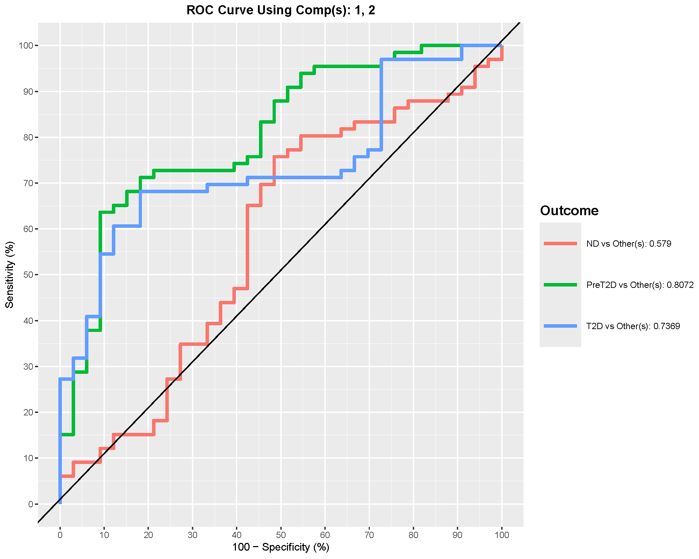

# Understanding (s)PLS-DA

## Sparse Partial Least Squares Discriminant Analysis (sPLS-DA)

Sparse Partial Least Squares Discriminant Analysis (sPLS-DA) is a
supervised multivariate method that projects samples into new components
that best separate predefined groups while selecting a small set of
discriminative variables (features). This page shows how to interpret
the main figures produced by the app and how to reproduce them.

## Example Results: CD3/CD28 Treatment

For this brief interpretation tutorial, we will use the results
generated using the CD3/CD28 treatment condition from the `ExampleData1`
dataset built into the application. The groups compared in this example
are Non-diabetic (ND), Pre-Diabetic (PreT2D), and Type 2 Diabetes (T2D).

### 2D Component Scores (Classification) Plot

This plot shows us the classification of the groups chosen for
comparison. Generally, we would look for any clustering or separation of
the groups. Ellipses seen in this figure are based on a 95% confidence
region, so there may be overlap however less overlap suggests better
discrimination. A better way to see discrimination would be to use the
option for `shaded background prediction`, however it takes a bit longer
due to computational time. The axis labels show the variance explained
by the component 1 in the x-axis (39% in this example) and component 2
in the y-axis (33% in this example). The title of the plot displays the
model accuracy which can provide a surface level view of the
classification done by the model. In our case the model accuracy is
55.6% in classifying the three different groups which is not great as it
is almost by chance. An accuracy of ≥ 70% is generally acceptable as it
shows good discrimination.

### Loadings Plot - Component 1

The loadings plot show the variables driving the separation along the
first component. The loadings plot show the magnitude of the loadings
(seen by the scale at the bottom). The signs, whether negative or
positive are of direction relative to the component’s score and should
not be interpreted as a p-value would and should be interpreted as to
how strong the contribution of those features are in the model. To make
interpretation easy, we can think about taking the absolute value of the
loadings, for example in our plot we see that cytokine IFN-G has a
magnitude of ≈ -0.4. Based on this, the \|-0.4\| magnitude would be 0.4
which would still make it the cytokine with the strongest contribution
to the model associated with T2D. Similarly, cytokine IL-31 is the 3rd
strongest contributor to the model associated with PreT2D group with a
magnitude of 0.3.

### Variable Importance in Projection (VIP) Scores - Component 1

VIP scores are another way to measure the most influential cytokines in
the model. Once again, we can see the same cytokines that we saw in the
loadings plot as the stronger contributors to have high VIP scores. A
general rule of thumb is that variables with VIP scores \> 1 are
considered to be the most influential (Tenenhaus 1998), which are used
for a second sPLS-DA model to determine if the classification is
improved. The secondary model is omitted from this tutorial.

### Receiver Operating Characteristic (ROC) Curve and Area Under the Curve (AUC)

The ROC curve and AUC value is a great way to evaluate the model’s
performance as the curve plots the true positive rate (sensitivity)
against the false positive rate (1-specificity). The AUC value provides
a single measure of a model’s ability to discriminate between classes,
with values closer to 1 indicating better performance. In our example,
the comparison of PreT2D vs Others shows us the best discrimination of
the model with an AUC value of 0.8. Since it is a multiclass comparison,
the AUC value is treated as one group versus all the others combined
(i.e. PreT2D vs. Others (ND +T2D)). Therefore, PreT2D has a fairly
distinct profile compared with the combined ND+T2D group and the model
is reasonably good at discriminating PreT2D from the other groups.

### Cross-Validation Performance

The sPLS-DA method in the application offers two different types of
cross-validation methods; Leave-One-Out (LOOCV) and M-fold
cross-validation. These methods are also used to evaluate the
performance of the model alongside the ROC curve and AUC as sPLS-DA is
prone to overfitting especially when working with small sample size and
large number of variables.

Difference between LOOCV and M-fold cross-validation:

- LOOCV: This method involves training the model on all data points
  except one, and then testing it on that single left-out data point.
  This process is repeated for every data point, and the results are
  averaged. LOOCV is computationally intensive but provides a nearly
  unbiased estimate of the model’s performance, especially useful for
  small datasets.

- M-fold Cross-Validation: In M-fold cross-validation (e.g., 5-fold or
  10-fold), the dataset is randomly divided into M equally sized subsets
  (folds). The model is trained on M-1 folds and validated on the
  remaining fold. This process is repeated 100 times, with each fold
  serving as the validation set exactly once. The results from each fold
  are then averaged to produce a single performance estimate.

In our example, we can see that the LOOCV error rate is plotted across
the first 2 components. The error rate is the rate of misclassification
in the model which in our case LOOCV shows an error rate of
approximately 49.5%. This is can be also reworded as, LOOCV shows us an
accuracy of 50.5%, which is similar to our overall model accuracy that
we saw earlier in the 2D classification plot.

### Below is a short animation on how to obtain the same result from the application:

### References

Tenenhaus, M. (1998). La regression PLS: theorie et pratique. Paris:
Editions Technic.

------------------------------------------------------------------------

*Last updated:* December 10, 2025
