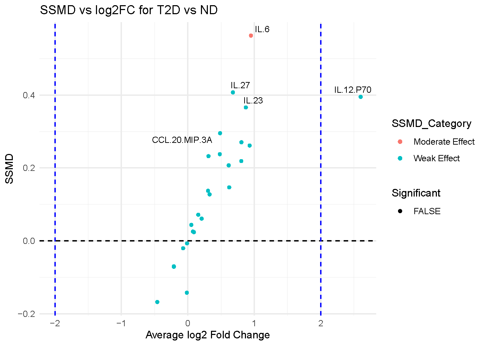

```{r, include = FALSE}
knitr::opts_chunk$set(
  collapse = TRUE,
  comment = "#>",
  fig.show = "hold",
  fig.pos = "center",
  out.width = "42%",
  fig.retina = 2
)
```

## Dual-Flashlight Plot

The dual-flashlight plot is a combined visualization of strictly standardized mean difference (SSMD) or effect size versus log2 fold-change, designed to help quickly identify cytokines that are both highly different between two conditions and statistically significant. 

Below is a plot generated for the comparison of subjects with Type 2 Diabetes (T2D) vs. Non Diabetic (ND). 



### The Axes

* X-axis: Average log2 Fold Change (log2FC)
This axis quantifies how much the level of a specific variable has changed between the groups. It is used to represent up-regulation and down-regulation symmetrically. For interpretation, when looking at positive values (> 0), the cytokines are more abundant (up-regulated) in subjects. On the other hand, when looking at negative values (< 0), the cytokines are less abundant (down-regulated) in subjects.

* Y-axis: Standardized Mean Difference (SSMD)
SSMD is a measure of effect size. It indicates the magnitude of the difference between the two groups while taking into account the variability within each group. In our plot for T2D vs. ND subjects, there are categories for the effect and significance.

The categories for effect size are as follows: 

  * Strong effect: SSMD >= 1
  * Moderate effect: 0.5 <= SSMD < 1
  * Weak effect: SSMD < 0.5

What determines significance is if the SSMD value is greater than the provided threshold **AND** the log2 fold change is greater than the provided threshold.

### Visual Cues

* Data Points: Each circle represents a different variable or cytokine in this example.
* Vertical Dashed Lines: These are set at log2FC = -2 and log2FC = 2. Any variable falling outside these lines has undergone at least a 4-fold change and is considered to have a large change in expression.
* Horizontal dashed line at SSMD = 0 separates net positive from negative effects.
* The significant legend identifies significant cytokines that are statistically significant **AND** have a log2FC value greater than the threshold provided. 

### Interpretation

* IL-12.P70: This is the only protein colored red, indicating it is statistically significant (p < 0.01). It is located in the top-left quadrant with a log2FC of approximately -2.8. This means IL-12.P70 is significantly down-regulated by more than 7-fold.  
* IL-6: This protein has the highest position on the y-axis, meaning it has the lowest p-value and is the most statistically significant finding in the dataset. However, its log2FC is approximately -0.8. While this change is statistically significant, its magnitude is modest (less than a 2-fold change) and does not cross the fold-change threshold line. 

### Below is a short animation on how to obtain the same result from the application: 

