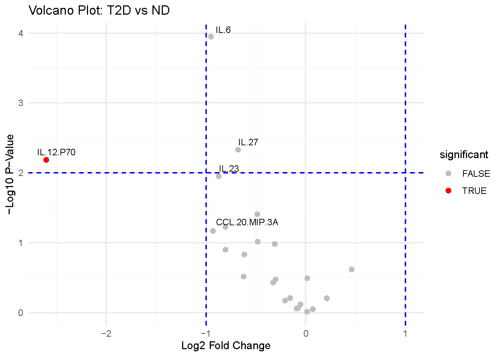

```{r, include = FALSE}
knitr::opts_chunk$set(
  collapse = TRUE,
  comment = "#>",
  fig.show = "hold",
  fig.pos = "center",
  out.width = "42%",
  fig.retina = 2
)
```

## Volcano Plot

The volcano plot is a type of scatter plot that simultaneously displays a measure of statistical significance (p-value) against the magnitude of change (fold change). It is an ideal tool for quickly identifying the most biologically relevant data points.

Below is a plot generated for the comparison of subjects with Type 2 Diabetes (T2D) vs. Non Diabetic (ND). 



### The Axes

* X-axis: Average log2 Fold Change (log2FC)
This axis quantifies how much the level of a specific variable has changed between the groups. It is used to represent up-regulation and down-regulation symmetrically. For interpretation, when looking at positive values (> 0), the cytokines are more abundant (up-regulated) in subjects. On the other hand, when looking at negative values (< 0), the cytokines are less abundant (down-regulated) in subjects.

* Y-axis: -Log10 p-value
This axis represents the statistical significance of the change observed for each cytokine. The p-value from a t-test is transformed using the negative logarithm base 10. This transformation is convenient because smaller p-values (which indicate greater significance) become larger numbers.

### Visual Cues

* Data Points: Each circle represents a different variable or cytokine in this example.
* Vertical Dashed Lines: These are set at log2FC = -1 and log2FC = 1. These lines represent a fold-change threshold (in this case, a 2-fold change). Data points falling outside these lines show a substantial change.
* Horizontal Dashed Line: This line is drawn at a -log10(P-Value) of 2, which corresponds to a p-value of 0.01. Any cytokine above this line is considered statistically significant.

### Interpretation


### Below is a short animation on how to obtain the same result from the application: 


